# DuckDB Quant Pipeline

A lightweight and modern data pipeline for extracting quantitative data from Google Sheets, transforming it with DuckDB and dbt, and orchestrating the workflow using Airflow. Final dashboards are served through Superset.

This pipeline is ideal for fast, reproducible analytics workflows without requiring complex infrastructure.

## 🛠️ Tech Stack

### **Data Pipeline Core**

| Component       | Description                          | Badge |
|-----------------|--------------------------------------|-------|
| **Extract**     | Google Sheets API (v4)               | [](https://developers.google.com/sheets/api)
| **Load**        | DuckDB embedded OLAP                 | [](https://duckdb.org) |
| **Transform**   | dbt with DuckDB adapter              | [](https://docs.getdbt.com) |

### **Orchestration & Visualization**

| Component       | Description                          | Badge |
|-----------------|--------------------------------------|-------|
| **Workflow**    | Airflow DAGs with Cosmos             | [](https://airflow.apache.org) |
| **Dashboards**  | Superset analytics                   | [](https://superset.apache.org) |


## 📈 Data Pipeline Flow

```mermaid
flowchart TD
    subgraph E[Airflow]
        A[Extract: Google Sheets]
        B[Load: DuckDB]
        C[Transform: dbt + DuckDB]
    end

    D[📊 Visualize: Superset]

    A --> B --> C --> D

    style A fill:#E6F4EA,stroke:#34A853,stroke-width:2px
    style B fill:#FFF3CC,stroke:#FFCD00,stroke-width:2px
    style C fill:#FDECEA,stroke:#FF5733,stroke-width:2px
    style D fill:#EAF1FB,stroke:#4285F4,stroke-width:2px
    style E stroke:#005B96,stroke-width:2px
```



## 🚀 Getting Started

### 💻 Prerequisites
- Python 3.10-3.11
- [UV](https://docs.astral.sh/uv/) (recommended) or pip 23+
- Google Cloud Service Account credentials

### 📚 Dependency Management

This project uses **`pyproject.toml`** as the single source of truth for dependencies, structured into logical groups


### 📦 Installation
```bash
# Create and activate virtual environment
uv venv
source .venv/bin/activate  # Linux/Mac

# Install dependencies (choose one)
uv pip install -e ".[extract]"          # Minimal (extraction only)
uv pip install -e ".[extract,transform]" # Extraction + transformation
```

### 🔍 Dependency Inspection
```bash
# List all installed packages with versions
uv pip list

# Filter for key packages
uv pip list | grep -E 'dbt|sqlfluff|duckdb'
```

### 🕹️ Orchestration Commands

Simplify infrastructure management with these Makefile shortcuts:

```bash
# Start all services
make up-all

# Stop services while preserving data
make down-all

# Nuclear option - full cleanup (containers, volumes, images)
make stop-all
```
