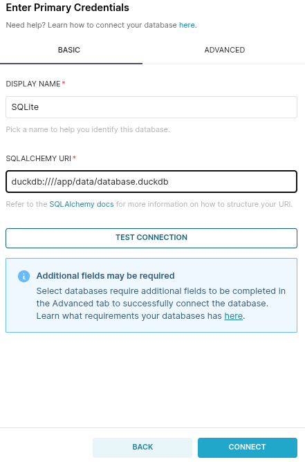

# Superset Setup with Docker and DuckDB

This guide explains how to set up Apache Superset using Docker and connect it to a local DuckDB database.

<!-- ## Generate a Secret Key

Run the following command to generate a secret key (used by Superset for session management):

```bash
openssl rand -base64 42
``` -->

## Start Superset with Docker Compose

Start the Superset services in detached mode:

```bash
docker-compose up -d
```

## Run Database Migrations

Apply database migrations inside the Superset container:

```bash
docker-compose exec superset superset db upgrade
```

## Create an Admin User

Create your admin account with the following command:

```bash
docker-compose exec superset superset fab create-admin \
  --username my_user \
  --firstname superset \
  --lastname apache \
  --email superset@example.com \
  --password my_password
```

## Initialize Superset

Run the initial setup to prepare Superset:

```bash
docker-compose exec superset superset init
```

## Access the Superset UI

You can now access Superset in your browser at:

[http://localhost:8088](http://localhost:8088)

## Connect to DuckDB

To connect to a DuckDB database located inside your container:

```
duckdb:////app/data/database.duckdb
```


Make sure the `.duckdb` file is available in the correct path inside the container.
